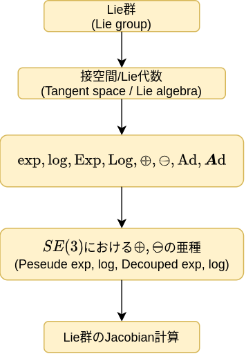

自分はVisual SLAMを作りたいと思い立ち[Basalt](https://gitlab.com/VladyslavUsenko/basalt)のコードを読み始めた。
するとなかなか理解できないLie群関係のJacobianがたくさん登場した。これらJacobianを導出するためいろいろと調査した。せっかくなので本ブログにまとめたい。

したがって、本記事ではBasaltに登場する再投影誤差$\boldsymbol{r}_{it}$のJacobianを導出するまでを説明したい。

導出するJacobian:
$$
\frac{D \boldsymbol{r}_{it}}{D T_{W C_t}},
\frac{D \boldsymbol{r}_{it}}{D T_{W C_h}},
\frac{D \boldsymbol{r}_{it}}{D _h\boldsymbol{m}_i},
$$

再投影誤差:
$$
\boldsymbol{r}_{it} = 
\pi ( T_{W C_t}^{-1} T_{W C_h} \boldsymbol{q}({}_h \boldsymbol{m}_i)) - \boldsymbol{z}_{it}
$$

これら式の記号の説明は本文内で行う。

もし、自分の間違った解釈や直したほうが良い表現を見つけた方は本ブログのリポジトリのIssueまで報告いただけるととてもありがたいです。コメント機能は組み込んでおりませんので…。

[Submit new issue](https://github.com/eryeden/eoee-blog/issues/new?labels=blog)

## Jacobian導出までのロードマップ
初めにBasaltでの問題設定とLie群を利用するモチベーションについて説明した後、下記ロードマップに従って書き進めていこうと思う。

